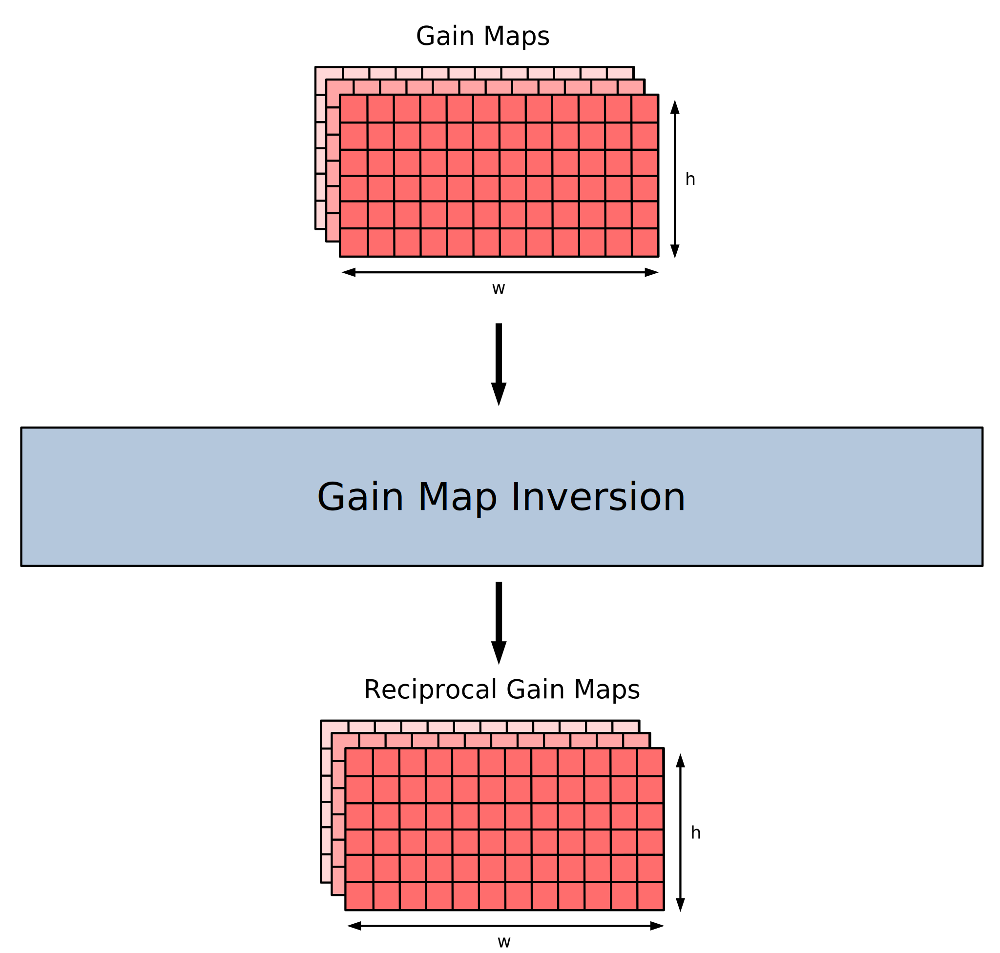

# Features

### Data Transformation
- [Gain Map Inversion](#Gain-Map-Inversion)
- [Energy Conversion](#Energy-Conversion)
- Photon Counting

### Data Selection
- Pixel Masking

### Data Compression
- Clustering
- Frame Summation
- Maximum Value

# Energy Conversion
The energy conversion algorithm transforms the raw output data of a detector module into 2D matrices of calibrated energy values. This calculation step is a prerequisite for most use-cases, as most algorithms operate on energy maps. **Note:** This algorithm expects reciprocal gain maps. If needed, reciprocals can be calculated during the program initialization phase using the `GainMapInversion` kernel.

#### Inputs
- array of detector module output data
- array of reciprocal gain maps (one per gain stage)
- array of pedestal maps (one per gain stage)
- number of frames to be processed
- **optional:** pixel mask (2D array of boolean values: `true` = pixel is part of the calculation, `false` = pixel is ignored)

#### Outputs
- energy maps (array of 2D matrices containing calibrated energy values)
- gain stage maps (array of 2D matrices containing the gain stage of each pixel in the current frame)

#### Usage
The algorithm is executed as an Alpaka-Kernel. Inputs are passed as pointers which must be accessible from the chosen Alpaka accelerator. Optional parameters accept `nullptr`. **TODO: code example**

# Gain Map Inversion
The Energy Conversion algorithm requires reciprocal gain maps. If reciprocals are not immediately loaded, this kernel can be used to invert an array of gain maps to their reciprocals. This step is usually executed once in the program initialization phase when the Alpaka accelerators are provided with the required values for data processing.

